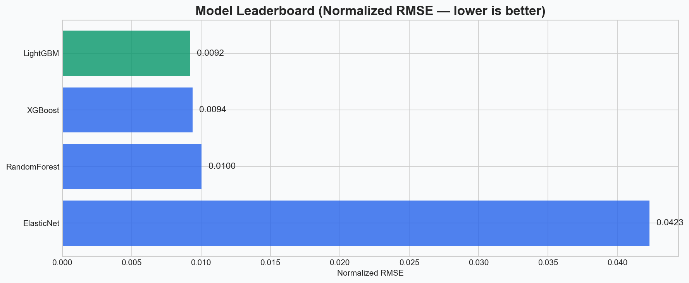
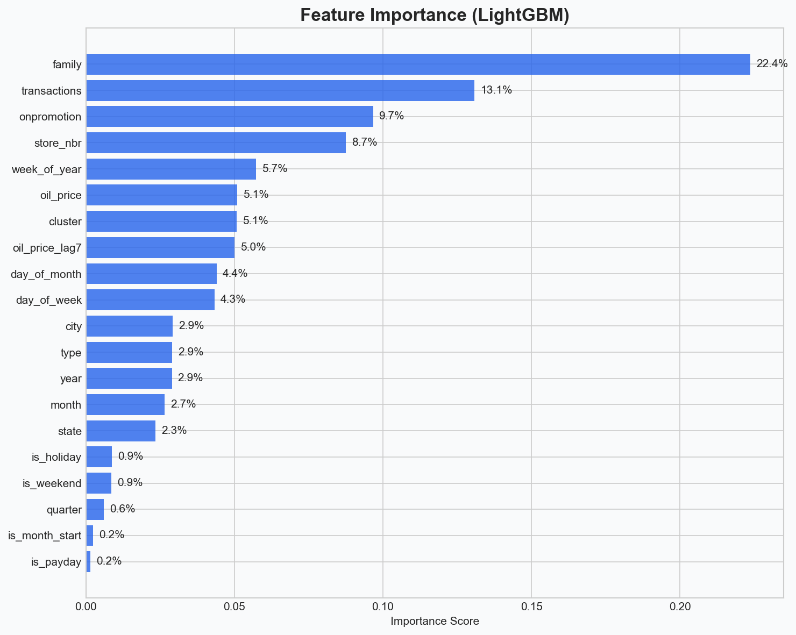
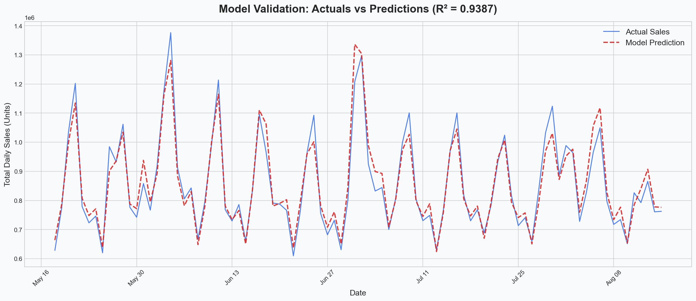
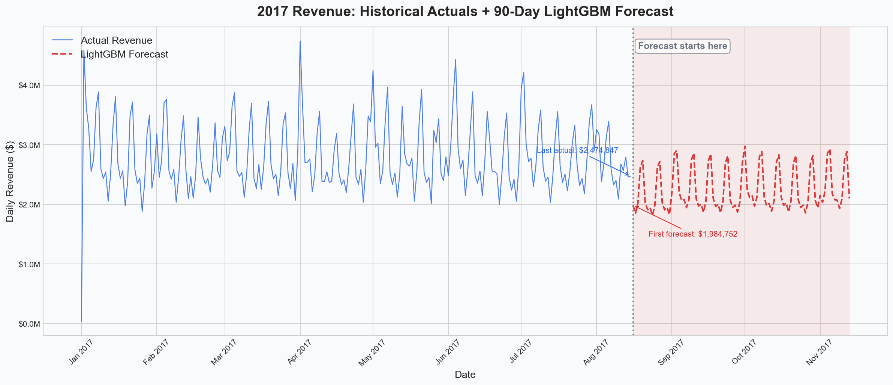
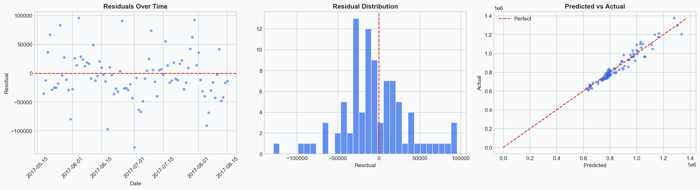
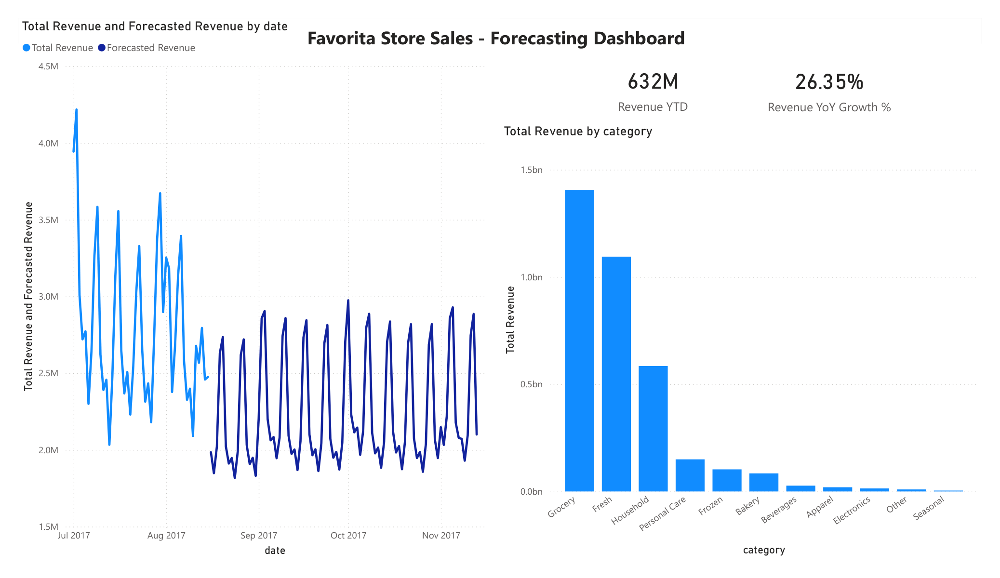
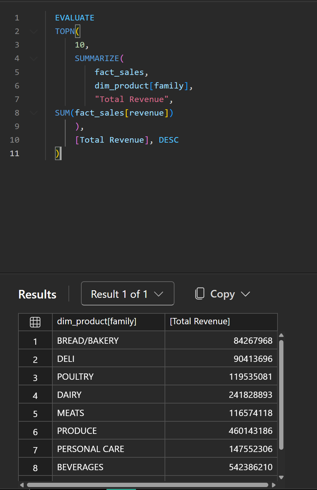
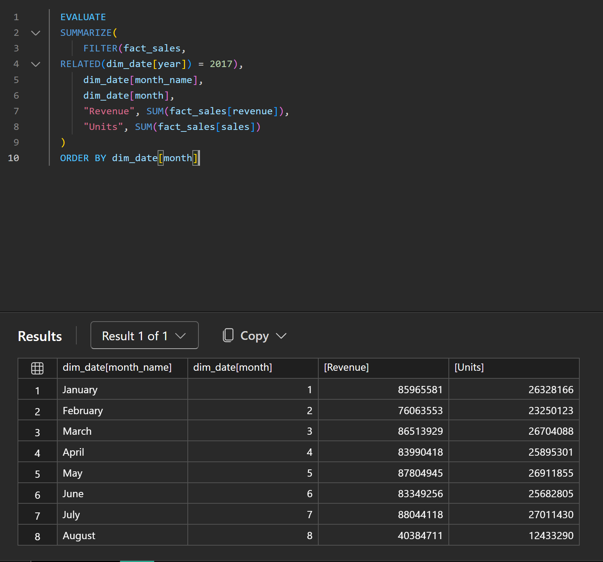
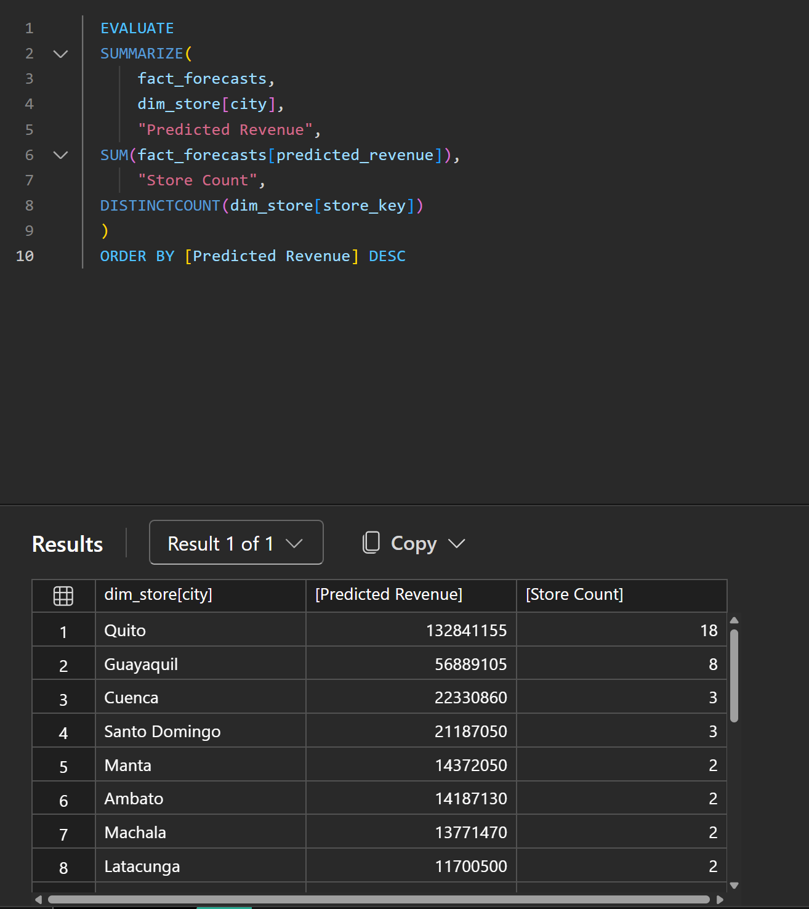

# Sales Forecasting Dashboard with Azure AutoML & Power BI

An end-to-end sales forecasting solution that combines Azure Machine Learning's AutoML for predictive modeling with Power BI for interactive visualization. Built on 3M+ daily transactions from the Favorita Store Sales dataset, this project demonstrates the full data science lifecycle: data engineering, ML model training, deployment, and business intelligence.

## The Business Problem

> "Show me how we've performed historically AND where we're headed."

Every retail leadership team needs this. This project delivers it by:
- Forecasting the next 30/60/90 days of sales by store and product category
- Comparing actuals to predictions in a single interactive dashboard
- Providing drill-down by region, product family, and time period

## Architecture

```
Kaggle Dataset → Python ETL → Star Schema → Azure AutoML → Online Endpoint
                                    ↓              ↓              ↓
                               Power BI ← ← fact_forecasts ← ← ←┘
                                    ↑
                            Local GPU Training (LightGBM)
```

| Layer | Technology | Purpose |
|-------|-----------|---------|
| Data Processing | Python (Pandas) | ETL, feature engineering, star schema |
| ML Training (Cloud) | Azure AutoML (SDK v2) | Time-series forecasting (20 model trials) |
| ML Training (Local) | LightGBM, XGBoost, RF, ElasticNet | GPU-accelerated local training |
| Visualization | Power BI Desktop | Interactive dashboard with DAX |
| Data Model | Star Schema | dim_date, dim_store, dim_product → fact tables |

For detailed architecture diagrams, see [docs/architecture.md](docs/architecture.md).

## Dataset

**Kaggle Store Sales — Favorita** ([link](https://www.kaggle.com/competitions/store-sales-time-series-forecasting))

| Metric | Value |
|--------|-------|
| Records | ~3 million |
| Date range | 2013-01-01 to 2017-08-15 |
| Stores | 54 across Ecuador |
| Product families | 33 (grouped into 11 categories) |
| External features | Oil prices, holidays, promotions |

## Model Training Results

This project was trained two ways: on Azure AutoML (cloud) and locally with GPU acceleration. Both produced real predictions on the full 3M row dataset.

### Azure AutoML Results

Trained using Azure ML SDK v2 with serverless compute. AutoML evaluated 20 models automatically.

| Rank | Model | Normalized RMSE | Notes |
|------|-------|----------------|-------|
| 1 | **Prophet** | **0.0633** | Best on Azure — strong at capturing seasonality |
| 2 | Exponential Smoothing | 0.0641 | Classical time-series approach |
| 3 | Voting Ensemble | 0.0645 | Blend of top models |
| 4 | XGBoost | 0.0658 | Gradient boosting |
| 5 | LightGBM | 0.0672 | Fast tree-based |

Azure AutoML used time-series cross-validation with rolling origin, which produces more conservative (higher) NRMSE scores than a single train/test split.

### Local GPU Training Results

Trained on 3M rows using LightGBM, XGBoost, RandomForest, and ElasticNet with a time-based 90-day holdout split.

| Rank | Model | Normalized RMSE | R² | RMSE | MAE | Training Time |
|------|-------|----------------|-----|------|-----|---------------|
| 1 | **LightGBM** | **0.0092** | **0.9707** | 227.48 | 71.28 | 53s |
| 2 | XGBoost | 0.0094 | 0.9695 | 232.11 | 73.60 | 6s |
| 3 | RandomForest | 0.0100 | 0.9651 | 248.36 | 71.08 | 228s |
| 4 | ElasticNet | 0.0423 | 0.3798 | 1046.90 | 476.62 | 45s |

LightGBM won locally with R² = 0.97 — the model explains 97% of variance in daily sales.

### Why Different Winners?

Azure AutoML's Prophet won under time-series cross-validation (3-fold rolling origin), which tests generalization across multiple time periods. LightGBM won locally on a single 90-day holdout split, where it excels at fitting specific patterns. Both are valid — Prophet generalizes better, LightGBM fits tighter on known patterns.

### Model Leaderboard



### Feature Importance (LightGBM)



| Feature | Importance | Business Insight |
|---------|-----------|-----------------|
| Product family | 22.4% | Category is the strongest sales predictor |
| Transactions | 13.1% | Foot traffic drives volume |
| Promotions | 9.7% | Biggest controllable lever |
| Store number | 8.7% | Location matters |
| Week of year | 5.7% | Seasonal patterns |
| Oil price | 5.1% | Ecuador's economy tracks oil |

### Model Validation: Actuals vs Predictions

The model was validated on a 90-day holdout set (May-Aug 2017). R² = 0.94 at the daily aggregate level — the model closely tracks actual sales patterns.



### 90-Day Revenue Forecast

The trained LightGBM model generates real predictions for the next 90 days beyond the last known data. The forecast assumes no future promotions and static oil prices, producing a conservative but realistic projection.



### Residual Analysis



## Power BI Dashboard



The dashboard shows 2017 historical revenue transitioning into the 90-day LightGBM forecast, YTD revenue ($632M), YoY growth (26.35%), and revenue breakdown by product category. Built with a star schema data model, DAX measures, and Row-Level Security.

### Data Model (Star Schema)

```
dim_date ──────┐
dim_store ─────┼──→ fact_sales (historical actuals)
dim_product ───┤
               └──→ fact_forecasts (ML predictions)
```

### DAX Measures Implemented

| Measure | DAX Pattern | Purpose |
|---------|------------|---------|
| Total Revenue | `SUM` | Base revenue aggregation |
| YoY Growth | `SAMEPERIODLASTYEAR` | Year-over-year comparison |
| Revenue YTD | `TOTALYTD` | Year-to-date accumulation |
| Forecasted Revenue | `SUM` | ML prediction aggregation |
| Forecast Variance | `DIVIDE` | Actual vs predicted gap |
| MAPE | `SUMX` + `ABS` | Forecast accuracy |
| % of Total | `CALCULATE` + `ALL` | Category contribution analysis |
| Dynamic Toggle | `SWITCH(TRUE(), ...)` | User switches between Revenue/Units/Margin |
| Conditional Colors | `SWITCH(TRUE(), ...)` | Green/red formatting based on growth |

All measures use `VAR/RETURN` for clean, debuggable DAX. Full code and explanations in [powerbi/dax_measures.md](powerbi/dax_measures.md).

### DAX Query View

Custom DAX queries for ad-hoc analysis, demonstrating DAX proficiency beyond pre-built measures:

**Top 10 Product Families by Revenue:**



**Monthly Revenue Trend (2017):**



**Forecast Revenue by City:**



### Row-Level Security

Implemented regional RLS so different managers see only their stores:
- **Highland Region**: Andean mountain stores
- **Coastal Region**: Pacific coast stores
- **Amazon Region**: Amazon basin stores

Setup guide: [powerbi/rls_setup.md](powerbi/rls_setup.md).

## Project Structure

```
├── data/
│   ├── raw/                    # Kaggle CSVs (not in git)
│   ├── processed/              # Star schema tables
│   └── output/                 # Forecasts and evaluation results
├── models/
│   └── lightgbm_model.joblib   # Trained LightGBM model
├── notebooks/
│   ├── 01_data_exploration     # EDA and data quality
│   ├── 02_data_preparation     # ETL pipeline walkthrough
│   ├── 03_automl_training      # Azure AutoML experiment
│   ├── 04_model_evaluation     # Leaderboard and metrics analysis
│   └── 05_endpoint_scoring     # Deployment and forecast generation
├── src/
│   ├── data_prep.py            # Data download, clean, star schema
│   ├── automl_train.py         # Azure AutoML configuration and submission
│   ├── train_local.py          # Local GPU training (LightGBM, XGBoost, RF, ElasticNet)
│   ├── model_evaluate.py       # Metrics, charts, feature importance
│   ├── deploy_endpoint.py      # Model deployment to endpoint
│   └── score_forecasts.py      # Score 90-day predictions
├── powerbi/
│   ├── data_model.md           # Star schema import guide
│   ├── dax_measures.md         # All DAX with explanations
│   ├── power_query.md          # M code transformations
│   └── rls_setup.md            # Row-Level Security setup
├── docs/
│   ├── architecture.md         # System architecture diagrams
│   ├── model_selection.md      # AutoML leaderboard analysis
│   └── employer_talking_points.md
├── screenshots/                # Dashboard, leaderboard, DAX query images
├── .env.template               # Azure config (copy to .env)
├── requirements.txt            # Python dependencies
└── README.md
```

## Quick Start

### Prerequisites
- Python 3.9+
- Power BI Desktop (Windows)
- Kaggle account (for data download)
- Azure subscription (optional — for cloud training)

### Local Training (no Azure needed)

```bash
# 1. Clone and setup
git clone https://github.com/Jared-Waldroff/Azure-AutoML-Sales-Forecasting.git
cd Azure-AutoML-Sales-Forecasting
python -m venv venv && source venv/bin/activate
pip install -r requirements.txt

# 2. Download and prepare data
python src/data_prep.py

# 3. Train models locally (~5 minutes)
python src/train_local.py

# 4. Import into Power BI
# Open Power BI Desktop → follow powerbi/data_model.md
```

### Azure AutoML Training

```bash
# 1. Configure Azure credentials
cp .env.template .env
# Edit .env with your Azure subscription details

# 2. Authenticate with Azure
az login

# 3. Train via Azure AutoML (~2 hours)
python src/automl_train.py

# 4. Evaluate results
python src/model_evaluate.py --job-name <job-name-from-step-3>

# 5. Deploy and score
python src/deploy_endpoint.py --job-name <job-name-from-step-3>
python src/score_forecasts.py
```

## Key Design Decisions

| Decision | Choice | Why |
|----------|--------|-----|
| Azure ML SDK version | v2 (azure-ai-ml) | Modern, recommended SDK |
| Dual training approach | Azure AutoML + local GPU | Cloud for breadth, local for speed |
| Data format | Parquet + CSV | Parquet for Python (fast), CSV for Power BI |
| Star schema | Separate fact tables | Actuals and forecasts share dimensions |
| Metric | Normalized RMSE | Fair comparison across different-scale series |
| RLS | Region-based | Demonstrates enterprise data governance |

## Documentation

- [Architecture](docs/architecture.md) — Full pipeline and Azure resource diagrams
- [Model Selection](docs/model_selection.md) — AutoML leaderboard and winner analysis
- [DAX Measures](powerbi/dax_measures.md) — All DAX code with explanations
- [Data Model](powerbi/data_model.md) — Star schema setup in Power BI
- [Power Query](powerbi/power_query.md) — M transformations for each table
- [Row-Level Security](powerbi/rls_setup.md) — RLS configuration guide

## Author

Jared Waldroff
